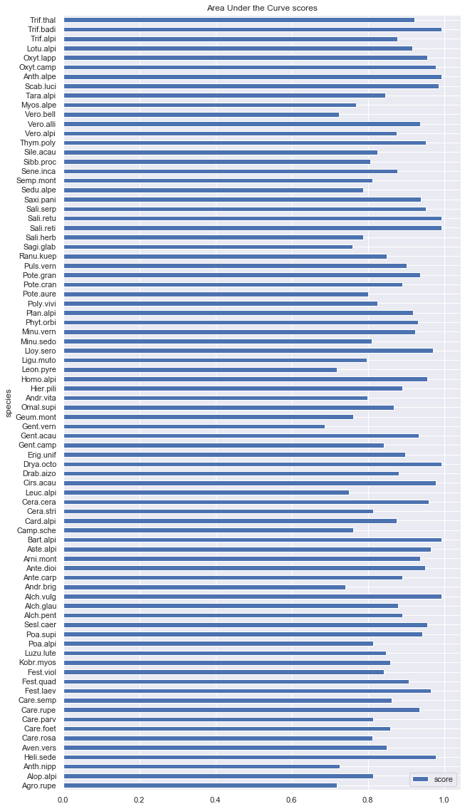
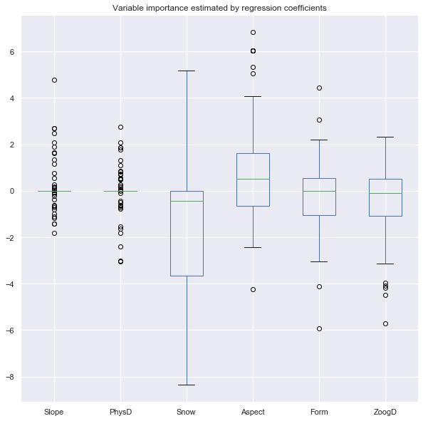
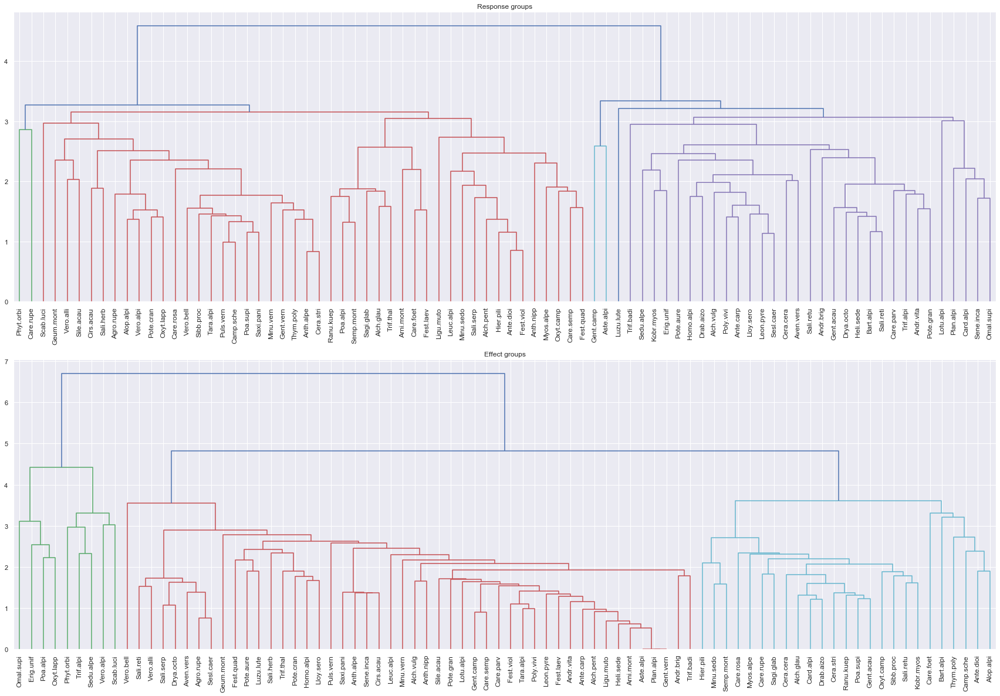

# Tutorial on using GeoAssocNet 

This tutorials shows how to use the proposed package on an example dataset to learn associations.

The following packages are required:
    - Data manipulation: Pandas, numpy
    - Plotting: matplotlib, seaborn
    - Machine learning: scikit-learn, tensorflow 1.5, keras 

## Part one: preparing the data

We offer a helper class DataPrep to automate data preprocessing, particularly that of environmental features.


```python
import warnings
warnings.filterwarnings("ignore")
```


```python
import pandas as pd
import numpy as np
import matplotlib.pyplot as plt
import seaborn as sns; sns.set(color_codes=True)
```

### Loading dataset 

The data used here is provided as part of the examples folder.
The data was obtained from ade4 (R package), it was produced as part of a paper from Choler et al 2005, provided within the examples/doc folder.


```python
folder_data="examples/Aravo/data/"
file_env=folder_data+"env.csv"
file_count=folder_data+"occur.csv"
```


```python
env=pd.read_csv(file_env,sep=";",decimal=".")
env.head()
```


<div>
<style scoped>
    .dataframe tbody tr th:only-of-type {
        vertical-align: middle;
    }

    .dataframe tbody tr th {
        vertical-align: top;
    }

    .dataframe thead th {
        text-align: right;
    }
</style>
<table border="1" class="dataframe">
  <thead>
    <tr style="text-align: right;">
      <th></th>
      <th>Aspect</th>
      <th>Slope</th>
      <th>Form</th>
      <th>PhysD</th>
      <th>ZoogD</th>
      <th>Snow</th>
    </tr>
  </thead>
  <tbody>
    <tr>
      <td>0</td>
      <td>7</td>
      <td>2</td>
      <td>1</td>
      <td>50</td>
      <td>no</td>
      <td>140</td>
    </tr>
    <tr>
      <td>1</td>
      <td>1</td>
      <td>35</td>
      <td>3</td>
      <td>40</td>
      <td>no</td>
      <td>140</td>
    </tr>
    <tr>
      <td>2</td>
      <td>5</td>
      <td>0</td>
      <td>3</td>
      <td>20</td>
      <td>no</td>
      <td>140</td>
    </tr>
    <tr>
      <td>3</td>
      <td>9</td>
      <td>30</td>
      <td>3</td>
      <td>80</td>
      <td>no</td>
      <td>140</td>
    </tr>
    <tr>
      <td>4</td>
      <td>9</td>
      <td>5</td>
      <td>1</td>
      <td>80</td>
      <td>no</td>
      <td>140</td>
    </tr>
  </tbody>
</table>
</div>


```python
counts=pd.read_csv(file_count,sep=";",decimal=".")
names=counts.columns.tolist()
occur=(counts>0).astype(int)
counts.head()
```


<div>
<style scoped>
    .dataframe tbody tr th:only-of-type {
        vertical-align: middle;
    }

    .dataframe tbody tr th {
        vertical-align: top;
    }

    .dataframe thead th {
        text-align: right;
    }
</style>
<table border="1" class="dataframe">
  <thead>
    <tr style="text-align: right;">
      <th></th>
      <th>Agro.rupe</th>
      <th>Alop.alpi</th>
      <th>Anth.nipp</th>
      <th>Heli.sede</th>
      <th>Aven.vers</th>
      <th>Care.rosa</th>
      <th>Care.foet</th>
      <th>Care.parv</th>
      <th>Care.rupe</th>
      <th>Care.semp</th>
      <th>Fest.laev</th>
      <th>Fest.quad</th>
      <th>Fest.viol</th>
      <th>Kobr.myos</th>
      <th>Luzu.lute</th>
      <th>Poa.alpi</th>
      <th>Poa.supi</th>
      <th>Sesl.caer</th>
      <th>Alch.pent</th>
      <th>Alch.glau</th>
      <th>Alch.vulg</th>
      <th>Andr.brig</th>
      <th>Ante.carp</th>
      <th>Ante.dioi</th>
      <th>Arni.mont</th>
      <th>Aste.alpi</th>
      <th>Bart.alpi</th>
      <th>Camp.sche</th>
      <th>Card.alpi</th>
      <th>Cera.stri</th>
      <th>Cera.cera</th>
      <th>Leuc.alpi</th>
      <th>Cirs.acau</th>
      <th>Drab.aizo</th>
      <th>Drya.octo</th>
      <th>Erig.unif</th>
      <th>Gent.camp</th>
      <th>Gent.acau</th>
      <th>Gent.vern</th>
      <th>Geum.mont</th>
      <th>...</th>
      <th>Hier.pili</th>
      <th>Homo.alpi</th>
      <th>Leon.pyre</th>
      <th>Ligu.muto</th>
      <th>Lloy.sero</th>
      <th>Minu.sedo</th>
      <th>Minu.vern</th>
      <th>Phyt.orbi</th>
      <th>Plan.alpi</th>
      <th>Poly.vivi</th>
      <th>Pote.aure</th>
      <th>Pote.cran</th>
      <th>Pote.gran</th>
      <th>Puls.vern</th>
      <th>Ranu.kuep</th>
      <th>Sagi.glab</th>
      <th>Sali.herb</th>
      <th>Sali.reti</th>
      <th>Sali.retu</th>
      <th>Sali.serp</th>
      <th>Saxi.pani</th>
      <th>Sedu.alpe</th>
      <th>Semp.mont</th>
      <th>Sene.inca</th>
      <th>Sibb.proc</th>
      <th>Sile.acau</th>
      <th>Thym.poly</th>
      <th>Vero.alpi</th>
      <th>Vero.alli</th>
      <th>Vero.bell</th>
      <th>Myos.alpe</th>
      <th>Tara.alpi</th>
      <th>Scab.luci</th>
      <th>Anth.alpe</th>
      <th>Oxyt.camp</th>
      <th>Oxyt.lapp</th>
      <th>Lotu.alpi</th>
      <th>Trif.alpi</th>
      <th>Trif.badi</th>
      <th>Trif.thal</th>
    </tr>
  </thead>
  <tbody>
    <tr>
      <td>0</td>
      <td>0</td>
      <td>0</td>
      <td>0</td>
      <td>0</td>
      <td>0</td>
      <td>1</td>
      <td>0</td>
      <td>0</td>
      <td>3</td>
      <td>0</td>
      <td>0</td>
      <td>2</td>
      <td>0</td>
      <td>1</td>
      <td>0</td>
      <td>1</td>
      <td>0</td>
      <td>0</td>
      <td>0</td>
      <td>0</td>
      <td>0</td>
      <td>0</td>
      <td>0</td>
      <td>0</td>
      <td>0</td>
      <td>0</td>
      <td>0</td>
      <td>0</td>
      <td>0</td>
      <td>0</td>
      <td>0</td>
      <td>0</td>
      <td>0</td>
      <td>0</td>
      <td>0</td>
      <td>0</td>
      <td>0</td>
      <td>0</td>
      <td>0</td>
      <td>0</td>
      <td>...</td>
      <td>0</td>
      <td>0</td>
      <td>0</td>
      <td>0</td>
      <td>0</td>
      <td>1</td>
      <td>1</td>
      <td>0</td>
      <td>0</td>
      <td>1</td>
      <td>0</td>
      <td>0</td>
      <td>0</td>
      <td>0</td>
      <td>0</td>
      <td>0</td>
      <td>0</td>
      <td>0</td>
      <td>0</td>
      <td>0</td>
      <td>1</td>
      <td>0</td>
      <td>0</td>
      <td>0</td>
      <td>0</td>
      <td>1</td>
      <td>0</td>
      <td>0</td>
      <td>0</td>
      <td>0</td>
      <td>0</td>
      <td>0</td>
      <td>0</td>
      <td>0</td>
      <td>1</td>
      <td>1</td>
      <td>0</td>
      <td>0</td>
      <td>0</td>
      <td>0</td>
    </tr>
    <tr>
      <td>1</td>
      <td>0</td>
      <td>0</td>
      <td>0</td>
      <td>0</td>
      <td>0</td>
      <td>2</td>
      <td>0</td>
      <td>1</td>
      <td>0</td>
      <td>0</td>
      <td>0</td>
      <td>0</td>
      <td>0</td>
      <td>3</td>
      <td>0</td>
      <td>2</td>
      <td>0</td>
      <td>0</td>
      <td>0</td>
      <td>0</td>
      <td>0</td>
      <td>0</td>
      <td>1</td>
      <td>0</td>
      <td>0</td>
      <td>0</td>
      <td>1</td>
      <td>1</td>
      <td>0</td>
      <td>0</td>
      <td>0</td>
      <td>0</td>
      <td>0</td>
      <td>0</td>
      <td>1</td>
      <td>0</td>
      <td>0</td>
      <td>0</td>
      <td>0</td>
      <td>0</td>
      <td>...</td>
      <td>0</td>
      <td>0</td>
      <td>0</td>
      <td>1</td>
      <td>1</td>
      <td>0</td>
      <td>0</td>
      <td>0</td>
      <td>0</td>
      <td>1</td>
      <td>0</td>
      <td>0</td>
      <td>0</td>
      <td>0</td>
      <td>0</td>
      <td>0</td>
      <td>0</td>
      <td>1</td>
      <td>2</td>
      <td>1</td>
      <td>0</td>
      <td>0</td>
      <td>1</td>
      <td>0</td>
      <td>0</td>
      <td>1</td>
      <td>0</td>
      <td>0</td>
      <td>0</td>
      <td>0</td>
      <td>0</td>
      <td>0</td>
      <td>0</td>
      <td>1</td>
      <td>0</td>
      <td>1</td>
      <td>0</td>
      <td>0</td>
      <td>0</td>
      <td>0</td>
    </tr>
    <tr>
      <td>2</td>
      <td>3</td>
      <td>0</td>
      <td>1</td>
      <td>0</td>
      <td>1</td>
      <td>2</td>
      <td>0</td>
      <td>0</td>
      <td>0</td>
      <td>1</td>
      <td>0</td>
      <td>3</td>
      <td>1</td>
      <td>4</td>
      <td>1</td>
      <td>0</td>
      <td>0</td>
      <td>0</td>
      <td>0</td>
      <td>1</td>
      <td>0</td>
      <td>0</td>
      <td>1</td>
      <td>0</td>
      <td>0</td>
      <td>0</td>
      <td>0</td>
      <td>1</td>
      <td>0</td>
      <td>0</td>
      <td>0</td>
      <td>0</td>
      <td>0</td>
      <td>0</td>
      <td>0</td>
      <td>1</td>
      <td>0</td>
      <td>1</td>
      <td>1</td>
      <td>2</td>
      <td>...</td>
      <td>0</td>
      <td>0</td>
      <td>0</td>
      <td>0</td>
      <td>0</td>
      <td>0</td>
      <td>1</td>
      <td>0</td>
      <td>0</td>
      <td>1</td>
      <td>2</td>
      <td>1</td>
      <td>0</td>
      <td>2</td>
      <td>0</td>
      <td>0</td>
      <td>0</td>
      <td>0</td>
      <td>0</td>
      <td>0</td>
      <td>0</td>
      <td>0</td>
      <td>1</td>
      <td>0</td>
      <td>0</td>
      <td>1</td>
      <td>0</td>
      <td>0</td>
      <td>0</td>
      <td>0</td>
      <td>1</td>
      <td>0</td>
      <td>1</td>
      <td>0</td>
      <td>1</td>
      <td>0</td>
      <td>0</td>
      <td>0</td>
      <td>0</td>
      <td>0</td>
    </tr>
    <tr>
      <td>3</td>
      <td>0</td>
      <td>0</td>
      <td>0</td>
      <td>2</td>
      <td>0</td>
      <td>2</td>
      <td>0</td>
      <td>0</td>
      <td>0</td>
      <td>0</td>
      <td>0</td>
      <td>1</td>
      <td>0</td>
      <td>1</td>
      <td>0</td>
      <td>2</td>
      <td>0</td>
      <td>1</td>
      <td>0</td>
      <td>0</td>
      <td>0</td>
      <td>0</td>
      <td>0</td>
      <td>0</td>
      <td>0</td>
      <td>0</td>
      <td>0</td>
      <td>1</td>
      <td>0</td>
      <td>0</td>
      <td>0</td>
      <td>0</td>
      <td>0</td>
      <td>1</td>
      <td>0</td>
      <td>1</td>
      <td>0</td>
      <td>0</td>
      <td>1</td>
      <td>0</td>
      <td>...</td>
      <td>0</td>
      <td>0</td>
      <td>0</td>
      <td>1</td>
      <td>0</td>
      <td>0</td>
      <td>1</td>
      <td>0</td>
      <td>0</td>
      <td>0</td>
      <td>0</td>
      <td>0</td>
      <td>0</td>
      <td>0</td>
      <td>0</td>
      <td>0</td>
      <td>0</td>
      <td>0</td>
      <td>0</td>
      <td>0</td>
      <td>2</td>
      <td>0</td>
      <td>1</td>
      <td>0</td>
      <td>0</td>
      <td>0</td>
      <td>2</td>
      <td>0</td>
      <td>0</td>
      <td>1</td>
      <td>1</td>
      <td>0</td>
      <td>0</td>
      <td>0</td>
      <td>0</td>
      <td>1</td>
      <td>0</td>
      <td>0</td>
      <td>0</td>
      <td>0</td>
    </tr>
    <tr>
      <td>4</td>
      <td>0</td>
      <td>0</td>
      <td>0</td>
      <td>0</td>
      <td>0</td>
      <td>0</td>
      <td>0</td>
      <td>0</td>
      <td>0</td>
      <td>0</td>
      <td>0</td>
      <td>3</td>
      <td>1</td>
      <td>1</td>
      <td>0</td>
      <td>0</td>
      <td>0</td>
      <td>1</td>
      <td>0</td>
      <td>0</td>
      <td>0</td>
      <td>0</td>
      <td>0</td>
      <td>0</td>
      <td>0</td>
      <td>0</td>
      <td>0</td>
      <td>1</td>
      <td>0</td>
      <td>0</td>
      <td>0</td>
      <td>0</td>
      <td>0</td>
      <td>0</td>
      <td>0</td>
      <td>0</td>
      <td>0</td>
      <td>0</td>
      <td>1</td>
      <td>0</td>
      <td>...</td>
      <td>0</td>
      <td>0</td>
      <td>0</td>
      <td>0</td>
      <td>0</td>
      <td>0</td>
      <td>1</td>
      <td>0</td>
      <td>0</td>
      <td>1</td>
      <td>0</td>
      <td>0</td>
      <td>0</td>
      <td>0</td>
      <td>0</td>
      <td>0</td>
      <td>0</td>
      <td>0</td>
      <td>0</td>
      <td>0</td>
      <td>1</td>
      <td>0</td>
      <td>0</td>
      <td>0</td>
      <td>0</td>
      <td>0</td>
      <td>0</td>
      <td>0</td>
      <td>0</td>
      <td>0</td>
      <td>0</td>
      <td>0</td>
      <td>0</td>
      <td>0</td>
      <td>0</td>
      <td>1</td>
      <td>0</td>
      <td>0</td>
      <td>0</td>
      <td>0</td>
    </tr>
  </tbody>
</table>
<p>5 rows × 82 columns</p>
</div>


### Preprocessing environmental data


```python
from geoassocnet.Util.DataPrep import DataPrep
```

    Using TensorFlow backend.
    


```python
num_vars=['Slope','PhysD','Snow']
cat_vars=['Aspect','Form','ZoogD']
prep=DataPrep(num_std=["minmax"]*len(num_vars),cat_trt="onehot")
```


```python
prep.load_dataset(feat=env,occur=occur,num=num_vars,cat=cat_vars)
```


```python
prep.preprocess_numeric()
prep.process_categoric()
prep.combine_covariates()
```


```python
prep.covariates.head()
```


<div>
<style scoped>
    .dataframe tbody tr th:only-of-type {
        vertical-align: middle;
    }

    .dataframe tbody tr th {
        vertical-align: top;
    }

    .dataframe thead th {
        text-align: right;
    }
</style>
<table border="1" class="dataframe">
  <thead>
    <tr style="text-align: right;">
      <th></th>
      <th>Slope</th>
      <th>PhysD</th>
      <th>Snow</th>
      <th>Aspect_0</th>
      <th>Aspect_1</th>
      <th>Aspect_2</th>
      <th>Aspect_3</th>
      <th>Aspect_4</th>
      <th>Aspect_5</th>
      <th>Aspect_6</th>
      <th>Aspect_7</th>
      <th>Form_0</th>
      <th>Form_1</th>
      <th>Form_2</th>
      <th>Form_3</th>
      <th>Form_4</th>
      <th>ZoogD_0</th>
      <th>ZoogD_1</th>
      <th>ZoogD_2</th>
    </tr>
  </thead>
  <tbody>
    <tr>
      <td>0</td>
      <td>0.057143</td>
      <td>0.625</td>
      <td>0.0</td>
      <td>0.0</td>
      <td>0.0</td>
      <td>0.0</td>
      <td>0.0</td>
      <td>0.0</td>
      <td>1.0</td>
      <td>0.0</td>
      <td>0.0</td>
      <td>1.0</td>
      <td>0.0</td>
      <td>0.0</td>
      <td>0.0</td>
      <td>0.0</td>
      <td>0.0</td>
      <td>1.0</td>
      <td>0.0</td>
    </tr>
    <tr>
      <td>1</td>
      <td>1.000000</td>
      <td>0.500</td>
      <td>0.0</td>
      <td>1.0</td>
      <td>0.0</td>
      <td>0.0</td>
      <td>0.0</td>
      <td>0.0</td>
      <td>0.0</td>
      <td>0.0</td>
      <td>0.0</td>
      <td>0.0</td>
      <td>0.0</td>
      <td>1.0</td>
      <td>0.0</td>
      <td>0.0</td>
      <td>0.0</td>
      <td>1.0</td>
      <td>0.0</td>
    </tr>
    <tr>
      <td>2</td>
      <td>0.000000</td>
      <td>0.250</td>
      <td>0.0</td>
      <td>0.0</td>
      <td>0.0</td>
      <td>0.0</td>
      <td>1.0</td>
      <td>0.0</td>
      <td>0.0</td>
      <td>0.0</td>
      <td>0.0</td>
      <td>0.0</td>
      <td>0.0</td>
      <td>1.0</td>
      <td>0.0</td>
      <td>0.0</td>
      <td>0.0</td>
      <td>1.0</td>
      <td>0.0</td>
    </tr>
    <tr>
      <td>3</td>
      <td>0.857143</td>
      <td>1.000</td>
      <td>0.0</td>
      <td>0.0</td>
      <td>0.0</td>
      <td>0.0</td>
      <td>0.0</td>
      <td>0.0</td>
      <td>0.0</td>
      <td>0.0</td>
      <td>1.0</td>
      <td>0.0</td>
      <td>0.0</td>
      <td>1.0</td>
      <td>0.0</td>
      <td>0.0</td>
      <td>0.0</td>
      <td>1.0</td>
      <td>0.0</td>
    </tr>
    <tr>
      <td>4</td>
      <td>0.142857</td>
      <td>1.000</td>
      <td>0.0</td>
      <td>0.0</td>
      <td>0.0</td>
      <td>0.0</td>
      <td>0.0</td>
      <td>0.0</td>
      <td>0.0</td>
      <td>0.0</td>
      <td>1.0</td>
      <td>1.0</td>
      <td>0.0</td>
      <td>0.0</td>
      <td>0.0</td>
      <td>0.0</td>
      <td>0.0</td>
      <td>1.0</td>
      <td>0.0</td>
    </tr>
  </tbody>
</table>
</div>


## Part Two: Training the model

### Habitat Suitability Model pretraining (Optional)


```python
perfs,params=prep.pretrain_glms()
```


```python
fig, ax=plt.subplots(1,1,figsize=(10,20))
perfs[0].plot.barh(x='species',y='score',ax=ax,title='Area Under the Curve scores')
```


    <matplotlib.axes._subplots.AxesSubplot at 0x298495c92c8>





```python
biases=np.array(params[0]['b'])
weights=np.concatenate([biases,params[0]['w']],axis=1)
weights_df=pd.DataFrame(data=weights,columns=['bias']+prep.covariates.columns.tolist())
```


```python
for c in prep.groups.keys():
    if len(prep.groups[c])>1:
        weights_df[c]=weights_df[prep.groups[c]].sum(axis=1)
```


```python
fig, ax=plt.subplots(1,1,figsize=(10,10))
weights_df[num_vars+cat_vars].plot.box(ax=ax,title='Variable importance estimated by regression coefficients')
```


    <matplotlib.axes._subplots.AxesSubplot at 0x29849f0c308>





### Training, validation data


```python
prep.train_test_split(meth="stratified",prob=0.8)
X_train=prep.covariates.iloc[prep.idx_train,:].values
X_test=prep.covariates.iloc[prep.idx_test,:].values

Y_train=counts.iloc[prep.idx_train,:].values
Y_test=counts.iloc[prep.idx_test,:].values
```

### Setting up  configuration files


```python
from geoassocnet.GeoAssoc import GeoAssoc, load_default_config
```

    WARNING:tensorflow:From D:\Data-driven\MTEC\GeoAssocNet\Source code\geoassocnet\Model\mhsm.py:12: The name tf.set_random_seed is deprecated. Please use tf.compat.v1.set_random_seed instead.
    
    


```python
from geoassocnet.Util.Util import avgnz
```

Computing the offset to be used


```python
offsets=avgnz(counts)
```
Use the helper script 'prepare_mhsm_params.py' or modify the given sample_hsm_archi.json

```python
training_config_file='examples/Aravo/config/association_learning.ini'
```

To understand the use of each of the following parameters, refer to the documentation.


```python
conf=load_default_config(training_config_file)
for k in conf.keys():
    print("%s = %s" %(k,conf[k]))
```

    exposure = True
    use_covariates = True
    intercept = False
    fixedoccur = False
    w_sigma2 = 1.0
    archi_desc_file = examples/Aravo/config/hsm_archi.json
    archi_plot_file = examples/Aravo/archi.png
    plot = False
    bias = True
    offset = False
    dist = negbin
    assoc_plasticity = False
    k = 4
    use_reg = True
    ar_sigma2 = 1.0
    prior = lasso
    lambda_lasso = 0.1
    use_penalty = False
    emb_initializer = uniform
    fixed_rho = False
    optim = sgd
    sample_ratio = 0.2
    use_valid = True
    lr = 0.01
    use_decay = False
    lr_update_step = 10000
    lr_update_scale = 0.5
    batch_size = 1
    max_iter = 5000
    nprint = 1000
    


```python
geoasso_model=GeoAssoc(config=training_config_file,labels=names,name_dataset="aravo",target="count")
```

Hereafter, we launch the training for a few epochs (5)


```python
logg= geoasso_model.train_interaction_model(dataset=(X_train,Y_train),verbose=1,init_weights=weights,offset=offsets)
```

    Splitting train and validation sets
    Computation graph creation (static)
    WARNING:tensorflow:From C:\Users\saras\Anaconda3\envs\phd\lib\site-packages\keras\backend\tensorflow_backend.py:517: The name tf.placeholder is deprecated. Please use tf.compat.v1.placeholder instead.
    
    WARNING:tensorflow:From C:\Users\saras\Anaconda3\envs\phd\lib\site-packages\keras\backend\tensorflow_backend.py:74: The name tf.get_default_graph is deprecated. Please use tf.compat.v1.get_default_graph instead.
    
    WARNING:tensorflow:From C:\Users\saras\Anaconda3\envs\phd\lib\site-packages\keras\backend\tensorflow_backend.py:4138: The name tf.random_uniform is deprecated. Please use tf.random.uniform instead.
    
    Associations are constant in environmental space.
    WARNING:tensorflow:From D:\Data-driven\MTEC\GeoAssocNet\Source code\geoassocnet\Model\graph_builder.py:132: add_dispatch_support.<locals>.wrapper (from tensorflow.python.ops.array_ops) is deprecated and will be removed in a future version.
    Instructions for updating:
    Use tf.where in 2.0, which has the same broadcast rule as np.where
    WARNING:tensorflow:From D:\Data-driven\MTEC\GeoAssocNet\Source code\geoassocnet\Model\graph_builder.py:144: The name tf.random_shuffle is deprecated. Please use tf.random.shuffle instead.
    
    WARNING:tensorflow:From D:\Data-driven\MTEC\GeoAssocNet\Source code\geoassocnet\Model\zie.py:87: The name tf.train.GradientDescentOptimizer is deprecated. Please use tf.compat.v1.train.GradientDescentOptimizer instead.
    
    Computation graph initialization
    Setting pretrained HSM weights
    Begin training
    iteration[ 1000 ]: average llh, obj, and valid_llh are  [-37.14084598  37.97038547 -37.72163467]
    iteration[ 2000 ]: average llh, obj, and valid_llh are  [-32.61509368  33.41362784 -35.27614288]
    iteration[ 3000 ]: average llh, obj, and valid_llh are  [-31.74807224  32.52227663 -34.56119347]
    iteration[ 4000 ]: average llh, obj, and valid_llh are  [-30.6388657   31.36551423 -33.51814308]
    iteration[ 5000 ]: average llh, obj, and valid_llh are  [-30.22799086  30.91209529 -33.72637939]
    Associations are constant in environmental space.
    

### Evaluation

Here, we show how to evaluate a trained model given a test set


```python
perf_hsm, perf_im=geoasso_model.evaluate_model(testdata=(X_test,Y_test))
```

    Building graph...
    Associations are constant in environmental space.
    Initializing...
    Calculating llh of instances...
    


```python
print("Performance of HSM component" , perf_hsm)
```

    Performance of HSM component {'microauc': 0.9152115661664626}
    


```python
print("Performance of abundance component" , perf_im)
```

    Performance of abundance component {'avgposllh': -1.0007503, 'avgllh': -0.31357193, 'pos_deviance': 0.4259123505946079, 'deviances': [0.4534502606869548, 0.2431683138674426, 0.3212844092899039, 0.2676498925584386, 0.5685264216821897, 0.17913572341570966, 0.09645088849435433, 0.4926481506213004, 0.5844986215128712, 0.26917024999567685, 0.3444306518099249, 0.29687454258999657, 0.444720460396074, 1.162947439846317, 1.0358827178514054, 0.41771074645190576, 0.25988117684411605, 0.22799164278836093], 'AIC': 1804.6271438598633}
    

### Usage for conditional predictions of abundance


```python
t=0
C=[x for x in range(len(names)) if x!=t]
Yc=Y_test[:,C]
habsuit,avg_abund=geoasso_model.predict(X_test,C,Yc,t)
print('Predicting abundance of %s' % names[t])
(habsuit>0.5)*avg_abund
```

    Predicting abundance of Agro.rupe
    


    array([1.0522068 , 1.05130409, 1.10670363, 1.06189501, 1.07529159,
           1.06497403, 1.07882569, 1.09388892, 1.06864857, 1.09014261,
           1.094478  , 1.06442416, 1.05681031, 0.        , 0.        ,
           1.02005098, 1.02675532, 1.00796486])


### Unraveling associations 


```python
from geoassocnet.Util.Util import plot_association, plot_assoc_clustered
```


```python
assoc_df=geoasso_model.compute_associations(save=False,norm=True)
```

We ignore intraspecific associations estimated. 


```python
assoc_df*=(np.identity(len(names))==0)
```

### Applying biogeographic filtering


```python
from geoassocnet.Util.Util import cooccur, response_sim, biogeo_filter, plot_dendrograms
```


```python
cooc=cooccur(occur,names)
respsim=response_sim(weights)
sel_assoc=biogeo_filter(assoc_df,cooc,respsim,thoccur=0,thass=0.5,thresp=0.5,m=len(names))
```


```python
plot_association(sel_assoc,cmap='seismic_r',fileout='examples/Aravo/resp_sim.png',xdim=20,ydim=20,vmin=-1,vmax=1,title='Association matrix')
```


```python
sel_assoc
```


<div>
<style scoped>
    .dataframe tbody tr th:only-of-type {
        vertical-align: middle;
    }

    .dataframe tbody tr th {
        vertical-align: top;
    }

    .dataframe thead th {
        text-align: right;
    }
</style>
<table border="1" class="dataframe">
  <thead>
    <tr style="text-align: right;">
      <th></th>
      <th>Agro.rupe</th>
      <th>Alop.alpi</th>
      <th>Anth.nipp</th>
      <th>Heli.sede</th>
      <th>Aven.vers</th>
      <th>Care.rosa</th>
      <th>Care.foet</th>
      <th>Care.parv</th>
      <th>Care.rupe</th>
      <th>Care.semp</th>
      <th>Fest.laev</th>
      <th>Fest.quad</th>
      <th>Fest.viol</th>
      <th>Kobr.myos</th>
      <th>Luzu.lute</th>
      <th>Poa.alpi</th>
      <th>Poa.supi</th>
      <th>Sesl.caer</th>
      <th>Alch.pent</th>
      <th>Alch.glau</th>
      <th>Alch.vulg</th>
      <th>Andr.brig</th>
      <th>Ante.carp</th>
      <th>Ante.dioi</th>
      <th>Arni.mont</th>
      <th>Aste.alpi</th>
      <th>Bart.alpi</th>
      <th>Camp.sche</th>
      <th>Card.alpi</th>
      <th>Cera.stri</th>
      <th>Cera.cera</th>
      <th>Leuc.alpi</th>
      <th>Cirs.acau</th>
      <th>Drab.aizo</th>
      <th>Drya.octo</th>
      <th>Erig.unif</th>
      <th>Gent.camp</th>
      <th>Gent.acau</th>
      <th>Gent.vern</th>
      <th>Geum.mont</th>
      <th>...</th>
      <th>Hier.pili</th>
      <th>Homo.alpi</th>
      <th>Leon.pyre</th>
      <th>Ligu.muto</th>
      <th>Lloy.sero</th>
      <th>Minu.sedo</th>
      <th>Minu.vern</th>
      <th>Phyt.orbi</th>
      <th>Plan.alpi</th>
      <th>Poly.vivi</th>
      <th>Pote.aure</th>
      <th>Pote.cran</th>
      <th>Pote.gran</th>
      <th>Puls.vern</th>
      <th>Ranu.kuep</th>
      <th>Sagi.glab</th>
      <th>Sali.herb</th>
      <th>Sali.reti</th>
      <th>Sali.retu</th>
      <th>Sali.serp</th>
      <th>Saxi.pani</th>
      <th>Sedu.alpe</th>
      <th>Semp.mont</th>
      <th>Sene.inca</th>
      <th>Sibb.proc</th>
      <th>Sile.acau</th>
      <th>Thym.poly</th>
      <th>Vero.alpi</th>
      <th>Vero.alli</th>
      <th>Vero.bell</th>
      <th>Myos.alpe</th>
      <th>Tara.alpi</th>
      <th>Scab.luci</th>
      <th>Anth.alpe</th>
      <th>Oxyt.camp</th>
      <th>Oxyt.lapp</th>
      <th>Lotu.alpi</th>
      <th>Trif.alpi</th>
      <th>Trif.badi</th>
      <th>Trif.thal</th>
    </tr>
  </thead>
  <tbody>
    <tr>
      <td>Agro.rupe</td>
      <td>-0.000000</td>
      <td>0.000000</td>
      <td>0.571793</td>
      <td>0.620867</td>
      <td>0.000000</td>
      <td>0.578332</td>
      <td>-0.000000</td>
      <td>0.733255</td>
      <td>0.0</td>
      <td>0.000000</td>
      <td>0.714388</td>
      <td>0.963253</td>
      <td>0.000000</td>
      <td>0.664524</td>
      <td>0.768111</td>
      <td>-0.000000</td>
      <td>-0.00000</td>
      <td>0.527116</td>
      <td>-0.000000</td>
      <td>0.000000</td>
      <td>-0.000000</td>
      <td>0.817148</td>
      <td>-0.000000</td>
      <td>-0.000000</td>
      <td>0.000000</td>
      <td>-0.806051</td>
      <td>-0.000000</td>
      <td>0.000000</td>
      <td>-0.000000</td>
      <td>0.99810</td>
      <td>-0.000000</td>
      <td>0.000000</td>
      <td>0.000000</td>
      <td>-0.691808</td>
      <td>-0.000000</td>
      <td>0.000000</td>
      <td>-0.000000</td>
      <td>0.781760</td>
      <td>0.000000</td>
      <td>0.000000</td>
      <td>...</td>
      <td>-0.000000</td>
      <td>-0.000000</td>
      <td>0.000000</td>
      <td>0.535677</td>
      <td>-0.853190</td>
      <td>0.000000</td>
      <td>-0.000000</td>
      <td>-0.000000</td>
      <td>0.000000</td>
      <td>-0.000000</td>
      <td>0.591738</td>
      <td>0.00000</td>
      <td>0.000000</td>
      <td>0.861191</td>
      <td>0.000000</td>
      <td>-0.000000</td>
      <td>0.907909</td>
      <td>-0.000000</td>
      <td>-0.000000</td>
      <td>-0.000000</td>
      <td>0.896173</td>
      <td>0.776591</td>
      <td>0.000000</td>
      <td>-0.503025</td>
      <td>-0.000000</td>
      <td>0.750292</td>
      <td>-0.000000</td>
      <td>-0.000000</td>
      <td>0.927111</td>
      <td>0.000000</td>
      <td>0.000000</td>
      <td>0.544372</td>
      <td>0.000000</td>
      <td>0.000000</td>
      <td>-0.850407</td>
      <td>-0.0</td>
      <td>0.000000</td>
      <td>0.000000</td>
      <td>-0.000000</td>
      <td>-0.000000</td>
    </tr>
    <tr>
      <td>Alop.alpi</td>
      <td>-0.764306</td>
      <td>0.000000</td>
      <td>0.000000</td>
      <td>0.000000</td>
      <td>-0.000000</td>
      <td>-0.000000</td>
      <td>0.509363</td>
      <td>0.000000</td>
      <td>0.0</td>
      <td>0.000000</td>
      <td>0.000000</td>
      <td>-0.000000</td>
      <td>-0.000000</td>
      <td>-0.000000</td>
      <td>0.000000</td>
      <td>0.830774</td>
      <td>-0.00000</td>
      <td>-0.000000</td>
      <td>0.000000</td>
      <td>-0.000000</td>
      <td>-0.000000</td>
      <td>-0.000000</td>
      <td>-0.000000</td>
      <td>-0.000000</td>
      <td>-0.000000</td>
      <td>0.000000</td>
      <td>0.000000</td>
      <td>0.000000</td>
      <td>0.718659</td>
      <td>0.00000</td>
      <td>-0.000000</td>
      <td>0.554690</td>
      <td>-0.000000</td>
      <td>-0.000000</td>
      <td>-0.000000</td>
      <td>-0.000000</td>
      <td>-0.000000</td>
      <td>-0.000000</td>
      <td>0.000000</td>
      <td>0.951607</td>
      <td>...</td>
      <td>0.567364</td>
      <td>0.785595</td>
      <td>0.926479</td>
      <td>0.000000</td>
      <td>-0.000000</td>
      <td>0.873613</td>
      <td>-0.000000</td>
      <td>-0.000000</td>
      <td>0.971019</td>
      <td>-0.000000</td>
      <td>0.840713</td>
      <td>-0.00000</td>
      <td>-0.000000</td>
      <td>-0.000000</td>
      <td>0.686729</td>
      <td>-0.000000</td>
      <td>0.588189</td>
      <td>-0.000000</td>
      <td>-0.000000</td>
      <td>-0.000000</td>
      <td>0.000000</td>
      <td>0.000000</td>
      <td>-0.000000</td>
      <td>0.000000</td>
      <td>0.674409</td>
      <td>0.000000</td>
      <td>0.000000</td>
      <td>0.521526</td>
      <td>0.588103</td>
      <td>0.000000</td>
      <td>-0.000000</td>
      <td>-0.000000</td>
      <td>0.000000</td>
      <td>0.000000</td>
      <td>0.000000</td>
      <td>-0.0</td>
      <td>-0.653579</td>
      <td>0.000000</td>
      <td>-0.000000</td>
      <td>0.000000</td>
    </tr>
    <tr>
      <td>Anth.nipp</td>
      <td>-0.000000</td>
      <td>0.000000</td>
      <td>0.000000</td>
      <td>0.000000</td>
      <td>-0.562413</td>
      <td>-0.000000</td>
      <td>-0.000000</td>
      <td>0.000000</td>
      <td>0.0</td>
      <td>0.684879</td>
      <td>0.000000</td>
      <td>0.000000</td>
      <td>0.000000</td>
      <td>0.537296</td>
      <td>0.000000</td>
      <td>0.516844</td>
      <td>-0.00000</td>
      <td>0.000000</td>
      <td>-0.000000</td>
      <td>-0.589645</td>
      <td>-0.794410</td>
      <td>-0.000000</td>
      <td>0.000000</td>
      <td>0.000000</td>
      <td>-0.795475</td>
      <td>-0.000000</td>
      <td>0.000000</td>
      <td>0.540038</td>
      <td>-0.000000</td>
      <td>0.00000</td>
      <td>-0.000000</td>
      <td>0.934681</td>
      <td>-0.758118</td>
      <td>0.000000</td>
      <td>0.000000</td>
      <td>-0.000000</td>
      <td>-0.933308</td>
      <td>0.000000</td>
      <td>0.867345</td>
      <td>0.559498</td>
      <td>...</td>
      <td>0.828318</td>
      <td>0.000000</td>
      <td>0.000000</td>
      <td>0.519954</td>
      <td>-0.000000</td>
      <td>0.737696</td>
      <td>-0.000000</td>
      <td>0.000000</td>
      <td>0.551322</td>
      <td>-0.000000</td>
      <td>0.648285</td>
      <td>-0.00000</td>
      <td>-0.550593</td>
      <td>0.000000</td>
      <td>0.729576</td>
      <td>-0.601994</td>
      <td>0.576994</td>
      <td>0.000000</td>
      <td>-0.000000</td>
      <td>-0.000000</td>
      <td>0.000000</td>
      <td>0.836247</td>
      <td>-0.000000</td>
      <td>0.592791</td>
      <td>-0.000000</td>
      <td>0.516201</td>
      <td>-0.000000</td>
      <td>0.000000</td>
      <td>0.000000</td>
      <td>0.780819</td>
      <td>0.691153</td>
      <td>0.000000</td>
      <td>0.000000</td>
      <td>0.000000</td>
      <td>0.000000</td>
      <td>0.0</td>
      <td>0.000000</td>
      <td>-0.000000</td>
      <td>0.816559</td>
      <td>-0.000000</td>
    </tr>
    <tr>
      <td>Heli.sede</td>
      <td>-0.000000</td>
      <td>-0.000000</td>
      <td>-0.000000</td>
      <td>0.000000</td>
      <td>0.000000</td>
      <td>0.000000</td>
      <td>-0.000000</td>
      <td>-0.000000</td>
      <td>-0.0</td>
      <td>0.843530</td>
      <td>0.565595</td>
      <td>0.000000</td>
      <td>0.932191</td>
      <td>0.000000</td>
      <td>0.000000</td>
      <td>-0.000000</td>
      <td>-0.00000</td>
      <td>0.000000</td>
      <td>-0.000000</td>
      <td>0.000000</td>
      <td>-0.000000</td>
      <td>0.000000</td>
      <td>0.000000</td>
      <td>0.000000</td>
      <td>-0.000000</td>
      <td>-0.598928</td>
      <td>-0.862922</td>
      <td>0.960995</td>
      <td>-0.000000</td>
      <td>0.00000</td>
      <td>-0.000000</td>
      <td>0.000000</td>
      <td>0.000000</td>
      <td>0.000000</td>
      <td>0.000000</td>
      <td>0.000000</td>
      <td>-0.000000</td>
      <td>0.000000</td>
      <td>0.713903</td>
      <td>0.000000</td>
      <td>...</td>
      <td>0.000000</td>
      <td>-0.000000</td>
      <td>-0.000000</td>
      <td>-0.000000</td>
      <td>0.000000</td>
      <td>-0.000000</td>
      <td>-0.000000</td>
      <td>0.730816</td>
      <td>-0.000000</td>
      <td>0.000000</td>
      <td>-0.000000</td>
      <td>-0.00000</td>
      <td>0.578081</td>
      <td>0.629848</td>
      <td>-0.000000</td>
      <td>-0.000000</td>
      <td>0.000000</td>
      <td>0.000000</td>
      <td>-0.542406</td>
      <td>0.000000</td>
      <td>0.000000</td>
      <td>0.000000</td>
      <td>-0.513702</td>
      <td>-0.000000</td>
      <td>-0.000000</td>
      <td>0.000000</td>
      <td>0.527787</td>
      <td>-0.000000</td>
      <td>0.000000</td>
      <td>0.832257</td>
      <td>0.000000</td>
      <td>-0.000000</td>
      <td>-0.680041</td>
      <td>-0.812498</td>
      <td>-0.000000</td>
      <td>0.0</td>
      <td>0.000000</td>
      <td>0.000000</td>
      <td>0.000000</td>
      <td>-0.890963</td>
    </tr>
    <tr>
      <td>Aven.vers</td>
      <td>0.533511</td>
      <td>-0.000000</td>
      <td>0.000000</td>
      <td>-0.000000</td>
      <td>0.000000</td>
      <td>-0.000000</td>
      <td>-0.000000</td>
      <td>-0.000000</td>
      <td>-0.0</td>
      <td>0.739723</td>
      <td>0.000000</td>
      <td>0.000000</td>
      <td>0.844152</td>
      <td>0.595317</td>
      <td>0.000000</td>
      <td>-0.000000</td>
      <td>-0.00000</td>
      <td>0.615874</td>
      <td>-0.000000</td>
      <td>0.000000</td>
      <td>0.000000</td>
      <td>0.000000</td>
      <td>0.752334</td>
      <td>0.863085</td>
      <td>-0.000000</td>
      <td>-0.000000</td>
      <td>-0.000000</td>
      <td>0.679005</td>
      <td>-0.000000</td>
      <td>-0.00000</td>
      <td>-0.000000</td>
      <td>0.000000</td>
      <td>-0.000000</td>
      <td>0.593493</td>
      <td>0.000000</td>
      <td>0.611778</td>
      <td>-0.000000</td>
      <td>0.605914</td>
      <td>0.574203</td>
      <td>-0.000000</td>
      <td>...</td>
      <td>0.000000</td>
      <td>-0.590510</td>
      <td>-0.000000</td>
      <td>-0.000000</td>
      <td>0.000000</td>
      <td>-0.000000</td>
      <td>-0.000000</td>
      <td>0.772138</td>
      <td>-0.000000</td>
      <td>-0.000000</td>
      <td>-0.000000</td>
      <td>0.00000</td>
      <td>0.000000</td>
      <td>0.000000</td>
      <td>-0.000000</td>
      <td>-0.000000</td>
      <td>-0.000000</td>
      <td>0.000000</td>
      <td>-0.000000</td>
      <td>0.595726</td>
      <td>-0.000000</td>
      <td>0.000000</td>
      <td>-0.000000</td>
      <td>0.000000</td>
      <td>-0.000000</td>
      <td>0.000000</td>
      <td>0.000000</td>
      <td>-0.000000</td>
      <td>-0.000000</td>
      <td>0.795669</td>
      <td>0.728841</td>
      <td>0.000000</td>
      <td>-0.641216</td>
      <td>-0.768016</td>
      <td>0.000000</td>
      <td>0.0</td>
      <td>0.796423</td>
      <td>-0.000000</td>
      <td>0.623849</td>
      <td>-0.000000</td>
    </tr>
    <tr>
      <td>...</td>
      <td>...</td>
      <td>...</td>
      <td>...</td>
      <td>...</td>
      <td>...</td>
      <td>...</td>
      <td>...</td>
      <td>...</td>
      <td>...</td>
      <td>...</td>
      <td>...</td>
      <td>...</td>
      <td>...</td>
      <td>...</td>
      <td>...</td>
      <td>...</td>
      <td>...</td>
      <td>...</td>
      <td>...</td>
      <td>...</td>
      <td>...</td>
      <td>...</td>
      <td>...</td>
      <td>...</td>
      <td>...</td>
      <td>...</td>
      <td>...</td>
      <td>...</td>
      <td>...</td>
      <td>...</td>
      <td>...</td>
      <td>...</td>
      <td>...</td>
      <td>...</td>
      <td>...</td>
      <td>...</td>
      <td>...</td>
      <td>...</td>
      <td>...</td>
      <td>...</td>
      <td>...</td>
      <td>...</td>
      <td>...</td>
      <td>...</td>
      <td>...</td>
      <td>...</td>
      <td>...</td>
      <td>...</td>
      <td>...</td>
      <td>...</td>
      <td>...</td>
      <td>...</td>
      <td>...</td>
      <td>...</td>
      <td>...</td>
      <td>...</td>
      <td>...</td>
      <td>...</td>
      <td>...</td>
      <td>...</td>
      <td>...</td>
      <td>...</td>
      <td>...</td>
      <td>...</td>
      <td>...</td>
      <td>...</td>
      <td>...</td>
      <td>...</td>
      <td>...</td>
      <td>...</td>
      <td>...</td>
      <td>...</td>
      <td>...</td>
      <td>...</td>
      <td>...</td>
      <td>...</td>
      <td>...</td>
      <td>...</td>
      <td>...</td>
      <td>...</td>
      <td>...</td>
    </tr>
    <tr>
      <td>Oxyt.lapp</td>
      <td>-0.000000</td>
      <td>-0.000000</td>
      <td>-0.000000</td>
      <td>0.000000</td>
      <td>0.000000</td>
      <td>0.747184</td>
      <td>0.000000</td>
      <td>0.509709</td>
      <td>-0.0</td>
      <td>-0.780969</td>
      <td>-0.000000</td>
      <td>0.000000</td>
      <td>-0.000000</td>
      <td>-0.000000</td>
      <td>0.000000</td>
      <td>-0.000000</td>
      <td>0.00000</td>
      <td>-0.000000</td>
      <td>0.000000</td>
      <td>0.000000</td>
      <td>0.000000</td>
      <td>0.000000</td>
      <td>-0.655974</td>
      <td>-0.000000</td>
      <td>0.000000</td>
      <td>-0.000000</td>
      <td>-0.000000</td>
      <td>-0.000000</td>
      <td>0.000000</td>
      <td>0.00000</td>
      <td>0.000000</td>
      <td>-0.000000</td>
      <td>0.000000</td>
      <td>-0.663641</td>
      <td>-0.600825</td>
      <td>0.000000</td>
      <td>0.000000</td>
      <td>-0.000000</td>
      <td>-0.704460</td>
      <td>-0.000000</td>
      <td>...</td>
      <td>-0.000000</td>
      <td>-0.000000</td>
      <td>0.000000</td>
      <td>0.000000</td>
      <td>-0.701933</td>
      <td>-0.000000</td>
      <td>0.656039</td>
      <td>-0.000000</td>
      <td>-0.000000</td>
      <td>0.000000</td>
      <td>0.000000</td>
      <td>0.00000</td>
      <td>0.000000</td>
      <td>0.000000</td>
      <td>-0.000000</td>
      <td>0.000000</td>
      <td>0.000000</td>
      <td>-0.659954</td>
      <td>0.000000</td>
      <td>-0.000000</td>
      <td>0.629138</td>
      <td>-0.000000</td>
      <td>0.680140</td>
      <td>-0.000000</td>
      <td>0.000000</td>
      <td>-0.000000</td>
      <td>-0.000000</td>
      <td>-0.000000</td>
      <td>0.000000</td>
      <td>-0.000000</td>
      <td>-0.000000</td>
      <td>0.000000</td>
      <td>0.000000</td>
      <td>0.000000</td>
      <td>-0.666727</td>
      <td>-0.0</td>
      <td>-0.000000</td>
      <td>0.000000</td>
      <td>-0.000000</td>
      <td>0.000000</td>
    </tr>
    <tr>
      <td>Lotu.alpi</td>
      <td>0.000000</td>
      <td>0.524127</td>
      <td>0.000000</td>
      <td>-0.000000</td>
      <td>-0.000000</td>
      <td>-0.886701</td>
      <td>0.000000</td>
      <td>-0.000000</td>
      <td>0.0</td>
      <td>0.000000</td>
      <td>-0.000000</td>
      <td>-0.000000</td>
      <td>-0.626484</td>
      <td>-0.000000</td>
      <td>-0.000000</td>
      <td>0.735501</td>
      <td>0.00000</td>
      <td>-0.000000</td>
      <td>0.000000</td>
      <td>-0.714617</td>
      <td>-0.000000</td>
      <td>-0.958503</td>
      <td>0.000000</td>
      <td>-0.000000</td>
      <td>-0.729042</td>
      <td>0.000000</td>
      <td>0.000000</td>
      <td>-0.000000</td>
      <td>0.000000</td>
      <td>-0.73421</td>
      <td>0.000000</td>
      <td>0.553224</td>
      <td>-0.000000</td>
      <td>0.515297</td>
      <td>0.000000</td>
      <td>-0.708761</td>
      <td>-0.515554</td>
      <td>-0.676966</td>
      <td>0.000000</td>
      <td>0.000000</td>
      <td>...</td>
      <td>0.595355</td>
      <td>0.638694</td>
      <td>0.000000</td>
      <td>0.000000</td>
      <td>0.601415</td>
      <td>0.000000</td>
      <td>-0.000000</td>
      <td>0.000000</td>
      <td>0.000000</td>
      <td>-0.000000</td>
      <td>0.000000</td>
      <td>-0.51254</td>
      <td>-0.682635</td>
      <td>-0.929767</td>
      <td>0.000000</td>
      <td>0.000000</td>
      <td>-0.000000</td>
      <td>0.000000</td>
      <td>0.000000</td>
      <td>-0.000000</td>
      <td>-0.689969</td>
      <td>-0.000000</td>
      <td>-0.000000</td>
      <td>0.870811</td>
      <td>0.526509</td>
      <td>-0.000000</td>
      <td>0.000000</td>
      <td>0.000000</td>
      <td>-0.000000</td>
      <td>-0.000000</td>
      <td>-0.000000</td>
      <td>-0.000000</td>
      <td>0.000000</td>
      <td>0.000000</td>
      <td>0.000000</td>
      <td>0.0</td>
      <td>-0.000000</td>
      <td>-0.000000</td>
      <td>0.577655</td>
      <td>0.608795</td>
    </tr>
    <tr>
      <td>Trif.alpi</td>
      <td>-0.000000</td>
      <td>0.957876</td>
      <td>0.000000</td>
      <td>0.000000</td>
      <td>-0.000000</td>
      <td>-0.000000</td>
      <td>0.606422</td>
      <td>0.000000</td>
      <td>0.0</td>
      <td>-0.000000</td>
      <td>0.000000</td>
      <td>-0.000000</td>
      <td>-0.802694</td>
      <td>-0.000000</td>
      <td>-0.000000</td>
      <td>0.854441</td>
      <td>-0.00000</td>
      <td>-0.000000</td>
      <td>0.528698</td>
      <td>-0.000000</td>
      <td>-0.734189</td>
      <td>-0.000000</td>
      <td>-0.000000</td>
      <td>-0.738760</td>
      <td>-0.000000</td>
      <td>0.000000</td>
      <td>0.000000</td>
      <td>-0.000000</td>
      <td>0.714028</td>
      <td>-0.00000</td>
      <td>0.000000</td>
      <td>0.000000</td>
      <td>-0.622210</td>
      <td>-0.000000</td>
      <td>-0.000000</td>
      <td>-0.000000</td>
      <td>-0.000000</td>
      <td>-0.548419</td>
      <td>0.000000</td>
      <td>0.755209</td>
      <td>...</td>
      <td>0.000000</td>
      <td>0.000000</td>
      <td>0.939686</td>
      <td>0.000000</td>
      <td>-0.000000</td>
      <td>0.773131</td>
      <td>-0.000000</td>
      <td>-0.000000</td>
      <td>0.848061</td>
      <td>-0.000000</td>
      <td>0.709549</td>
      <td>-0.00000</td>
      <td>-0.687473</td>
      <td>-0.000000</td>
      <td>0.702438</td>
      <td>0.000000</td>
      <td>0.000000</td>
      <td>-0.000000</td>
      <td>-0.000000</td>
      <td>-0.739600</td>
      <td>0.000000</td>
      <td>-0.000000</td>
      <td>-0.000000</td>
      <td>0.000000</td>
      <td>0.876732</td>
      <td>-0.000000</td>
      <td>0.000000</td>
      <td>0.783846</td>
      <td>0.000000</td>
      <td>-0.000000</td>
      <td>-0.000000</td>
      <td>-0.000000</td>
      <td>0.000000</td>
      <td>0.000000</td>
      <td>0.000000</td>
      <td>-0.0</td>
      <td>-0.636571</td>
      <td>0.000000</td>
      <td>0.000000</td>
      <td>0.000000</td>
    </tr>
    <tr>
      <td>Trif.badi</td>
      <td>-0.000000</td>
      <td>0.000000</td>
      <td>0.537742</td>
      <td>0.500293</td>
      <td>-0.000000</td>
      <td>-0.000000</td>
      <td>-0.589824</td>
      <td>-0.000000</td>
      <td>0.0</td>
      <td>0.898445</td>
      <td>0.000000</td>
      <td>0.000000</td>
      <td>0.000000</td>
      <td>0.000000</td>
      <td>0.000000</td>
      <td>0.000000</td>
      <td>-0.63538</td>
      <td>0.000000</td>
      <td>-0.659201</td>
      <td>-0.000000</td>
      <td>-0.722431</td>
      <td>-0.000000</td>
      <td>0.000000</td>
      <td>0.000000</td>
      <td>-0.748461</td>
      <td>-0.000000</td>
      <td>-0.000000</td>
      <td>0.807803</td>
      <td>-0.000000</td>
      <td>0.00000</td>
      <td>-0.927215</td>
      <td>0.000000</td>
      <td>-0.643716</td>
      <td>0.000000</td>
      <td>0.000000</td>
      <td>-0.000000</td>
      <td>-0.747035</td>
      <td>0.532212</td>
      <td>0.993075</td>
      <td>0.589662</td>
      <td>...</td>
      <td>0.000000</td>
      <td>0.000000</td>
      <td>-0.000000</td>
      <td>0.000000</td>
      <td>0.000000</td>
      <td>0.617863</td>
      <td>-0.957359</td>
      <td>0.000000</td>
      <td>0.000000</td>
      <td>-0.000000</td>
      <td>0.512922</td>
      <td>-0.00000</td>
      <td>-0.000000</td>
      <td>0.000000</td>
      <td>0.000000</td>
      <td>-0.849503</td>
      <td>0.000000</td>
      <td>0.000000</td>
      <td>-0.871483</td>
      <td>-0.000000</td>
      <td>0.000000</td>
      <td>0.000000</td>
      <td>-0.000000</td>
      <td>0.000000</td>
      <td>-0.000000</td>
      <td>0.000000</td>
      <td>0.000000</td>
      <td>0.000000</td>
      <td>0.000000</td>
      <td>0.936837</td>
      <td>0.000000</td>
      <td>-0.000000</td>
      <td>-0.000000</td>
      <td>-0.000000</td>
      <td>0.000000</td>
      <td>0.0</td>
      <td>0.000000</td>
      <td>-0.000000</td>
      <td>0.000000</td>
      <td>-0.000000</td>
    </tr>
    <tr>
      <td>Trif.thal</td>
      <td>0.000000</td>
      <td>0.000000</td>
      <td>0.799040</td>
      <td>0.000000</td>
      <td>-0.578816</td>
      <td>-0.532145</td>
      <td>-0.000000</td>
      <td>0.000000</td>
      <td>0.0</td>
      <td>0.650861</td>
      <td>0.000000</td>
      <td>0.000000</td>
      <td>0.000000</td>
      <td>0.000000</td>
      <td>0.000000</td>
      <td>0.000000</td>
      <td>-0.00000</td>
      <td>0.000000</td>
      <td>-0.000000</td>
      <td>-0.000000</td>
      <td>-0.683151</td>
      <td>-0.000000</td>
      <td>0.000000</td>
      <td>0.503495</td>
      <td>-0.759126</td>
      <td>-0.000000</td>
      <td>0.000000</td>
      <td>0.505018</td>
      <td>-0.000000</td>
      <td>0.00000</td>
      <td>-0.000000</td>
      <td>0.880507</td>
      <td>-0.693333</td>
      <td>0.000000</td>
      <td>0.000000</td>
      <td>0.000000</td>
      <td>-0.000000</td>
      <td>0.531788</td>
      <td>0.813571</td>
      <td>0.000000</td>
      <td>...</td>
      <td>0.000000</td>
      <td>-0.000000</td>
      <td>-0.000000</td>
      <td>0.548667</td>
      <td>-0.000000</td>
      <td>0.629653</td>
      <td>-0.934759</td>
      <td>0.000000</td>
      <td>0.000000</td>
      <td>-0.761815</td>
      <td>0.549941</td>
      <td>-0.00000</td>
      <td>-0.538087</td>
      <td>0.000000</td>
      <td>0.678899</td>
      <td>-0.000000</td>
      <td>0.000000</td>
      <td>-0.000000</td>
      <td>-0.000000</td>
      <td>0.000000</td>
      <td>-0.000000</td>
      <td>0.000000</td>
      <td>-0.000000</td>
      <td>0.000000</td>
      <td>-0.000000</td>
      <td>0.000000</td>
      <td>-0.000000</td>
      <td>0.000000</td>
      <td>0.000000</td>
      <td>0.771263</td>
      <td>0.801186</td>
      <td>0.000000</td>
      <td>0.000000</td>
      <td>0.000000</td>
      <td>0.000000</td>
      <td>0.0</td>
      <td>0.596502</td>
      <td>-0.608837</td>
      <td>0.860555</td>
      <td>-0.000000</td>
    </tr>
  </tbody>
</table>
<p>82 rows × 82 columns</p>
</div>


```python
plot_association(sel_assoc,cmap='seismic_r',fileout='examples/Aravo/sel_assoc.png',xdim=20,ydim=20,vmin=-1,vmax=1,title='Association matrix')
```

# Part Three: Association analysis

Hereafter, we show how to analyze the learnt association matrix. We illustrate on the final association matrix (obtained after full training). Particularly, we analyze the similarities in terms of associations by performing a (hierarchical) co-clustering of the association matrix. 


```python
assoc_df=pd.read_csv('examples/Aravo/results/plant_associations.csv',sep=";",decimal=".",index_col=0)
```


```python
g=plot_assoc_clustered(assoc_df,file=None)
```


To retrieve the species clusters shown in the figure, use the object returned by the previous function and pass it to read_dendrogram as follow:


```python
labcol=[names[x] for x in g.dendrogram_col.reordered_ind]
labrow=[names[x] for x in g.dendrogram_row.reordered_ind]
```


```python
_, _, fig=plot_dendrograms(g=g,labx='Response groups',laby='Effect groups',names=names)
fig
```





```python
fig.savefig('examples/Aravo/results/hierarchies.pdf',bbox_inches='tight')
```


```python

```
